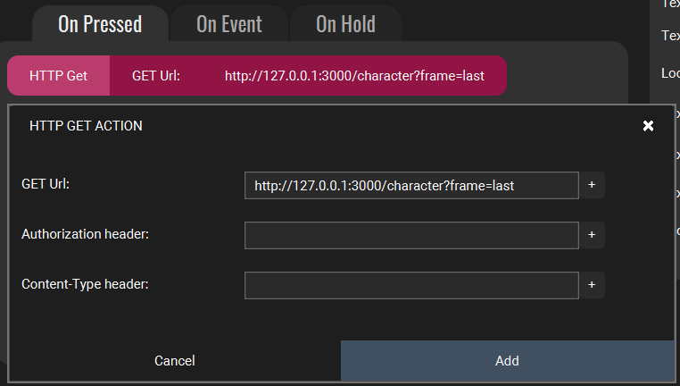
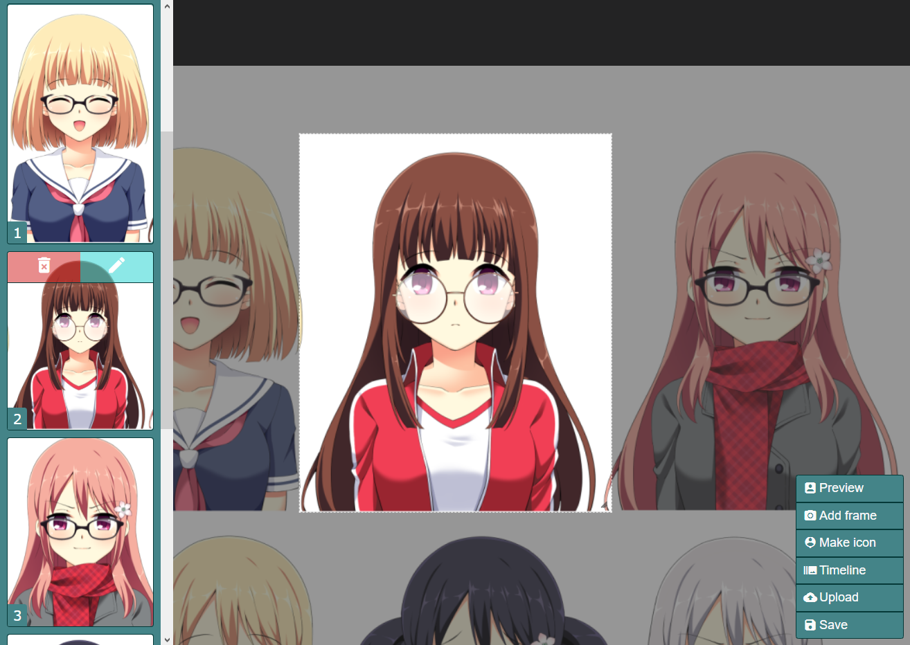

# Low cost sprite based V-Tubing

A lightweight Sprite based VTube environment, that you can control with Stream Deck and Touch Portal buttons.

If you like the content, consider [buying me a ☕](https://www.buymeacoffee.com/mazeakin).

## Requirements

- Basic [NodeJS](http://nodejs.org) knowledge.
- Basic HTML, JS, CSS, jQuery knowledge.
- [Stream Deck Web Requests plugin](https://apps.elgato.com/plugins/gg.datagram.web-requests) and/or [Touch Portal](https://www.touch-portal.com/)'s HTTP GET action.

## Instalation/Usage

#### If you don't want to fiddle with any of the manual parts, here is a [Windows version](https://github.com/Mazeakin/Maze-Static-VTube/releases) you can just download and use.

First, install the required Node dependencies in the project folder:  
`npm i ws socket.io express`

Then, run the main script:  
`node app.js`

## Making it visible on OBS

Simply add the `http://127.0.0.1:3000/` address as OBS Browser source.  
That's all.

## Using with Stream Deck

1. Point to the (running) webservice (usually, `ws://127.0.0.1:3000/`);
2. From `0` (zero) to `F-1` (total frames minus one), specify the frame you want as "message".

## Using with Touch Portal

1. Point to the (running) webpage (usually, `http://127.0.0.1:3000/character`) with the `?frame=` query string;
2. From `0` (zero) to `F-1` (total frames minus one), specify the frame you want as `?frame=` query string.

## Other commands

- Use `flip` and `unflip` as commands to (un)flip the frame.
- Use `first` to jump to the first frame recorded in the `frames.json` file.
- Use `last` to jump to the last frame recorded in the `frames.json` file.
- Use `random` to jump to a random frame recorded in the `frames.json` file.
- Use `hide` to hide the avatar.
- Any invalid command or innexistent frame number will remove the sprite from screen.

## Character editor.

By opening the `http://127.0.0.1:3000/map` URL (after starting the server) or by opening the [APP](https://github.com/Mazeakin/Maze-Static-VTube/releases), you'll find a character editor.

#### These are the currently available actions:

- Drag and drop the sheet (by dragging from outside the preview box).
- Resize the preview box.
- Snapshot a frame.
- Delete a frame (by hovering it in the timeline).
- Reorganize frames (drag and drop).
- Click sprites in the timeline to quickly navigate and preview.
- Toggle the timeline.
- Save (replaces your current `frames.json` file, but makes a backup once a day inside the `backups` folder).

## Mapping the character by hand

_First, you are brave._

- You'll need the `X` and `Y` coordinates, plus the `width` and `height` of each frame, in order to map it correctly (use CSS background-position as reference, top left is `X-0` and `Y-0`);
- Then, proceed to fill the `frames` array inside the `assets/frames.json` file.

## Replacing a spritesheet by hand

Just replace the `assets/character.png` file.

## Todo

- 🟨 Code cleanup.
- ⬜ Remember last frame used on boot.
- ⬜ Make replacing a frame in the editor less annoying.
- ⬜ Support for small movement when microphone is detected.
- ⬜ Support for loop through predefined frames when microphone is detected.
- ⬜ Support for second set of frames for mouth movement when microphone is detected.
- ⬜ Support for idle set of frames.
- ✅ Support for uploading new spritesheet to the editor.
- ✅ Character preview inside the editor.
- ✅ Character editor.
- ✅ "first", "last" and "random" actions.
- ✅ "flip" and "unflip" actions.

## FAQ

Q: _Why do you use WebSockets on Stream Deck?_  
A: It's faster.

Q: _Why do you use GET on Touch Portal?_  
A: It's more compatible and easy to use. Plus, no plugin needed.

Q: _Are you going to improve this project?_  
A: I'll probably add minor modifications. But I won't do much. As it is part of my (bigger) [caramel.gg](http://caramel.gg) project.

Q: _Your demo has a white background on my OBS!_  
A: Yes. I'm lazy and didn't bother finding a demo sheet without background.

Q: _Your demo has more frames than the three you mapped!_  
A: I. Am. LAZY!

Q: _I already use the 3000 port for something else. Can I change the script?_  
A: Yes.

Q: _Can I change the script in general?_  
A: Yes. But I'd appreciate if you shared your customization with everyone else.

Q: _I see a lot of unused code. Are you adding new stuff?_  
A: Yes. I may send commits with placeholder code I am working on.

Q: _Can I message you if I have issues or suggestions?_  
A: Sure. You can open an issue here, or message me on [Discord](https://discord.gg/eYfSNQT) or [Twitter](https://twitter.com/Mazeakin).

## Credits

- Demo using [Female Character Sprite for Visual Novel](https://sutemo.itch.io/female-character).
- [SpriteTubeApp](https://github.com/Mazeakin/SpriteTubeApp) source code.
- [Buying me a ☕](https://www.buymeacoffee.com/mazeakin) is a nice way to show appreciation.
- You should credit me when using this script and app. A footnote is enough.

## Known bugs

- One to two pixels as margin error are randomly added/removed when saving from the editor. That means you need to fiddle with positions, till you get the perfect frame.
- The sprite frame actually working flawless (despite the item above) in the animation screen is actually a bug.
