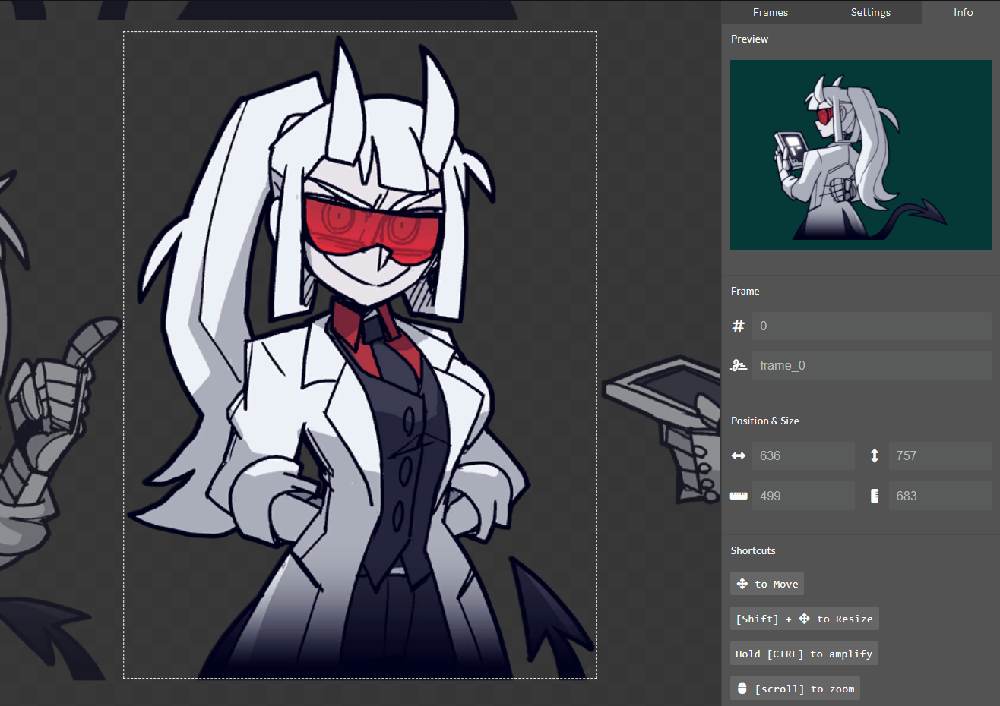

# Low cost sprite based V-Tubing

A lightweight Sprite based VTube environment, that you can control with Stream Deck or Websocket requests.

If you like the content, consider [buying me a ☕][url_coffee].

## Requirements

- Basic [NodeJS](http://nodejs.org) knowledge.
- Basic HTML, JS, CSS, jQuery knowledge.
- [Stream Deck SpriteTube Plugin][url_streamdeck_plugin] or [Stream Deck Web Requests Plugin][url_web_requests_plugin].

## Instalation/Usage

### Windows version

> The Windows version, usually, is a couple days behind the command line version.  
> As I have little experience with translating a NodeJS app to an executable.

If you don't want to fiddle with any of the manual parts, here is a [Windows version](https://github.com/Mazeakin/Maze-Static-VTube/releases) you can just download and use.

### Command line (NodeJS)

First, install the required Node dependencies in the project folder:  
`npm i ws express express-es6-template-engine skia-canvas`

Then, run the main script:  
`node app.js`

## Making it visible on OBS

Simply add the [http://127.0.0.1:3000/](http://127.0.0.1:3000/) address as OBS Browser source.  
That's all.

## Using with Stream Deck ([SpriteTube Plugin][url_streamdeck_plugin])

Just pick an action and follow the instructions.  
If you didn't change the default port, you should have little to no work with each action.


## Using with Stream Deck (Web Requests Plugin)

Set `URL` to `ws://localhost:3000/`  
Send a `JSON` formatted `Message` like the following.

```json
{ "action": "setFrame", "payload": "random" }
```

```json
{
  "action": "setFrameModifier",
  "payload": { "mod": "flip", "action": "flip|unflip|toggle" }
}
```


## Using with Touch Portal

> Working on a TouchPortal plugin.  
> It seems Touch Portal doesn't have any Websockets plugin. So you are kinda out of luck.

## Available commands

- Use `flip`, `unflip` and `toggleflip` as commands to (un)flip the frame.
- Use `first` to jump to the first frame.
- Use `last` to jump to the last frame.
- Use `random` to jump to a random frame.
- Use `hide` to hide the avatar.
- Use `show` to show the avatar.
- Any invalid command or innexistent frame number will remove the sprite from screen.

## Character editor.

By opening the [http://127.0.0.1:3000/editor.html](http://127.0.0.1:3000/editor.html) URL (after starting the server) or by opening the [APP](https://github.com/Mazeakin/Maze-Static-VTube/releases), you'll find a character editor.



#### These are the currently available actions:

- Upload a new spritesheet.
- Move the spritesheet (by dragging from outside the preview box).
- Resize the preview box.
- Snapshot a frame.
- Edit a frame (hover frames for buttons).
- Delete a frame (hover frames for buttons).
- Reorganize frames (drag and drop).
- Click sprites in the timeline to quickly navigate and preview.
- Toggle the timeline.
- Save (replaces your current `frames.json` file, but makes a backup once a day inside the `backups` folder).
- Preview.

## Mapping the character by hand

_First, you are brave._

- You'll need the `X` and `Y` coordinates, plus the `width` and `height` of each frame, in order to map it correctly (use CSS background-position as reference, top left is `X-0` and `Y-0`);
- Then, proceed to fill the `frames` array inside the `assets/frames.json` file.

## Replacing a spritesheet by hand

Just replace the `assets/character.png` file.

## FAQ

Q: _Why do you use WebSockets?_  
A: It's faster and simpler.

Q: _Are you going to improve this project?_  
A: ~I'll probably add minor modifications. But I won't do much. As it is part of my (bigger) [caramel.gg](http://caramel.gg) project.~ Yes.

Q: _Your demo has a white background on my OBS!_  
A: Yes. I'm lazy and didn't bother finding a demo sheet without background.

Q: _Your demo has more frames than the three you mapped!_  
A: I. Am. LAZY!

Q: _I already use the 3000 port for something else. Can I change the script?_  
A: Yes.

Q: _Can I change the script in general?_  
A: Yes. But I'd appreciate if you shared your customization with everyone else. And give credits.

Q: _I see a lot of unused code. Are you adding new stuff?_  
A: Yes. I may send commits with placeholder code I am working on.

Q: _Can I message you if I have issues or suggestions?_  
A: Sure. You can open an issue here, or message me on [Discord](https://discord.gg/eYfSNQT) or [Twitter](https://twitter.com/Mazeakin).

## Credits

- Demo using [Female Character Sprite for Visual Novel](https://sutemo.itch.io/female-character).
- [SpriteTubeApp](https://github.com/Mazeakin/SpriteTubeApp) source code.
- [Buying me a ☕][url_coffee] is a nice way to show appreciation.
- You should credit me when using this script and app. A footnote is enough.

## Known bugs

- One to two pixels as margin error are randomly added/removed when saving from the editor. That means you need to fiddle with positions, till you get the perfect frame.
- The sprite frame actually working flawless (despite the item above) in the player is actually a bug.

## Todo

- ⬜ Support for small movement when microphone is detected.
- ⬜ Support for loop through predefined frames when microphone is detected.
- ⬜ Support for second set of frames for mouth movement when microphone is detected.
- ⬜ Support for idle set of frames.
- ⬜ Party mode (be able to see someone else's avatar and frames).
- ✅ (0.3.0) Remove load from the player (make server send a base64 encoded image ready to use).
- ✅ (0.3.0) Sincronize all players in general.
- ✅ (0.3.0) Make "random" syncronize with all players.
- ✅ (APP) Backup download and upload.
- ✅ (Pre 0.3.0) Hold SHIFT to move the shpritesheet in bigger intervals. Add CTRL for even mode distance.
- ✅ (Pre 0.3.0) Frame info button.
- ✅ (Pre 0.3.0) Code cleanup.
- ✅ (Pre 0.3.0) Make replacing a frame in the editor less annoying.
- ✅ (Pre 0.3.0) Remember last frame used on boot (local to each player).
- ✅ (Pre 0.3.0) Snapshot a frame to use as icon.
- ✅ (Pre 0.3.0) Reload player when saving the timeline.
- ✅ (Pre 0.3.0) Show frame number in the editor.
- ✅ (Pre 0.3.0) Support for uploading new spritesheet to the editor.
- ✅ (Pre 0.3.0) Character preview inside the editor.
- ✅ (Pre 0.3.0) Character editor.
- ✅ (Pre 0.3.0) "first", "last" and "random" actions.
- ✅ (Pre 0.3.0) "flip" and "unflip" actions.

## Changelog

- (0.3.0) Introduced the [Stream Deck Plugin][url_streamdeck_plugin].
- (0.3.0) Removed HTTP GET and Socket.io integrgations.
- (0.3.0) Added `/player.html` endpoint.
- (0.3.0) Renamed "map" to "editor".
- (0.3.0) Renamed `/map.html` endpoint to `/editor.html`.
- (0.3.0) Removed comma separated commands.
- (0.3.0) Removed `/port` endpoint.
- (0.3.0) Several performance improvements.

[url_coffee]: https://www.buymeacoffee.com/mazeakin
[url_streamdeck_plugin]: https://github.com/Mazeakin/SpriteTube/releases/tag/stream-deck
[url_web_requests_plugin]: https://apps.elgato.com/plugins/gg.datagram.web-requests
